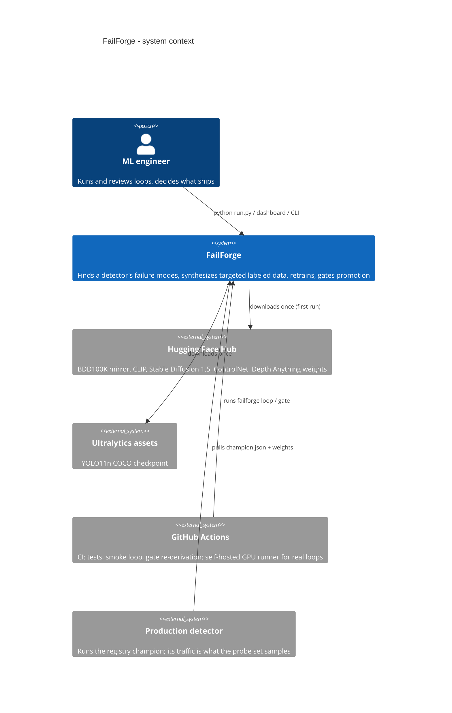
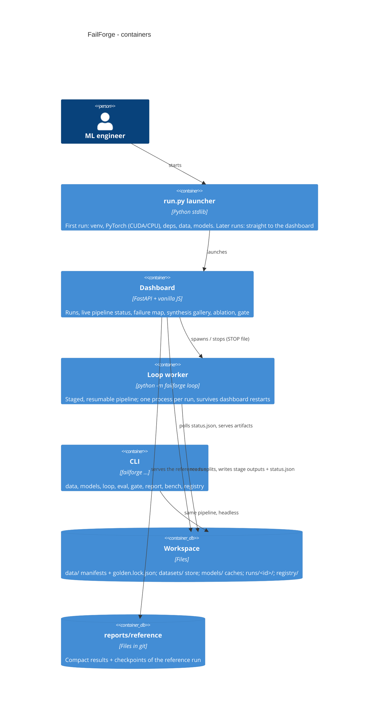
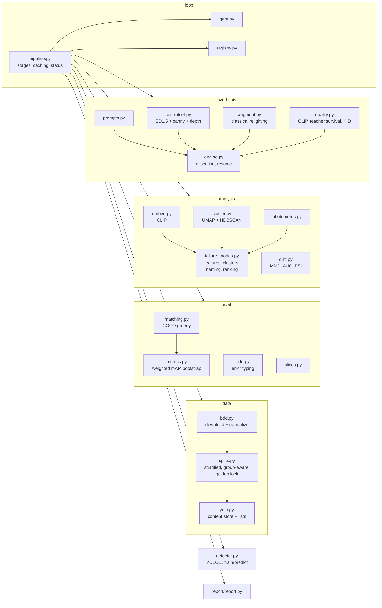
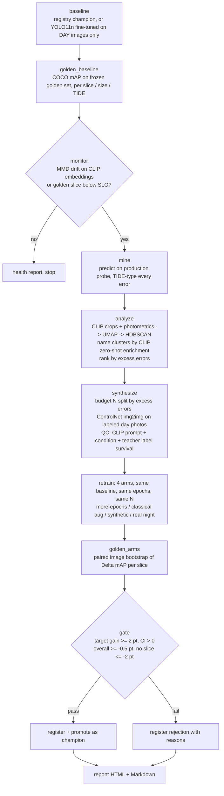

# FailForge architecture

FailForge is a closed loop around an object detector: **monitor → mine → understand → synthesize →
retrain → prove → promote**. This document describes the system at three C4 levels, then the loop
itself, the data contracts between stages, the decisions behind them, and what runs in CI.

## 1. System context (C4 level 1)

## 2. Containers (C4 level 2)

## 3. Components of the loop worker (C4 level 3)

## 4. The loop

Every stage writes `runs/<id>/<stage>/…` and `runs/<id>/stages/<stage>.json` (completion record
with a **fingerprint** of exactly the config fields it depends on, chained with its upstream
stages). Re-running a run skips finished stages whose fingerprint still matches: an interrupted
5-hour loop resumes mid-way; changing a gate threshold re-runs only the gate and the report.
Long stages are internally resumable too (synthesis appends each candidate's QC decision to
`qc.jsonl` as it happens). `status.json` is rewritten as work progresses; a `STOP` file in the run
folder makes the worker stop cleanly at the next progress update.

## 5. Data contracts

| artifact | producer | format | consumer |
|---|---|---|---|
| `data/manifests/<split>.jsonl` | data prepare | one `Sample` per line: id, image, size, boxes (abs. xyxy), attrs | everything |
| `golden.lock.json` | first prepare | ids + order-independent label digest | `make_splits` refuses to run if data drifted |
| `eval/<arm>_preds.npz` | golden eval | concatenated boxes/scores/classes + per-image counts | metrics, bootstrap |
| `eval/<arm>.json` | golden eval | overall + slices + sizes + per-class + TIDE | gate, report, dashboard, CI |
| `eval/deltas.json` | golden_arms | per arm per slice: delta, 95% CI, P(delta<=0) | gate, CI |
| `mine/mined.json` | mine | typed error records + sampled TPs (+ sampling rate) | analyze |
| `analyze/analysis.json` | analyze | clusters (stats, concepts, true-tag validation), modes, targets, 2-D points | synthesize, report, dashboard |
| `synthesize/<arm>/manifest.jsonl` | synthesize | Samples with inherited boxes, attrs `parent`, `condition` | retrain |
| `synthesize/<arm>/qc.jsonl` | synthesize | per candidate: scores, accepted, reasons | resume, report |
| `gate/gate.json` | gate | checks, decision, per-arm decisions | registry, CI, report |
| `registry/<profile>/champion.json` | gate | version, weights, golden headline, lineage | production, next loop |

## 6. Design decisions

**Plan the failure.** The baseline is trained on *daytime* BDD100K only, and the golden set is
stratified over day / night / dawn × weather. The drift is real (real night photos), known, and
measurable, so a gain is attributable. Without that, "the loop helped" is not falsifiable.

**Freeze the golden set.** Created once, pinned by ids + a label digest; the order is canonical so
paired comparisons line up across runs. Any change to its data aborts the run instead of silently
moving the goalposts.

**Leakage-free splits.** Assignment is by hashing a group key (BDD video id) so images that could
come from the same drive never straddle splits; a check runs at every `prepare`.

**Own the metric.** COCO mAP is implemented in numpy and verified to match pycocotools to 1e-6
(`tests/test_metrics.py`). Matching runs once; a slice is a 0/1 image weight vector and a bootstrap
resample is a multinomial weight vector, which is exactly equivalent to duplicating images. This
makes per-slice metrics and paired-bootstrap confidence intervals cheap enough to compute for
every arm and slice, every run.

**Errors, typed.** TIDE-style typing (miss / background / localization / class / both / duplicate)
says *what* to fix; "false positives" does not. Dupes are excluded from mining (an NMS issue, not a data issue).

**Clusters with a denominator.** True positives are embedded alongside errors (subsampled, with
the rate recorded), so every cluster has an error *rate* and a lift over the population, and
modes are ranked by *excess errors*. Big clusters of easy objects do not outrank small clusters
of hopeless ones.

**Name clusters without peeking.** Cluster labels come from CLIP zero-shot enrichment over a fixed
vocabulary; the dataset's tags are attached afterwards only to validate the unsupervised result.
A mode whose top condition cannot be synthesized (tiny distant objects) is reported as such.

**Labels for free, then verified.** ControlNet (Canny + depth) with img2img re-renders a labeled
day photo under the target condition while pinning its structure, so the source boxes remain
valid. img2img starts from a classically relit copy of the photo (its luminance dominates img2img;
from the daylight original, "night" came out as dusk with P(night) ≈ 0.4; from the relit copy it is
0.9–1.0), while the ControlNets read edges and depth from the original. Label validity is then
*checked* by an independent COCO detector (YOLO11s, never trained on BDD): objects it finds in the
source must still be found at the same place in the generated image. An earlier per-box
edge-correlation check was dropped because it scored even the geometry-identical classical
relighting near zero: edges change with lighting, objects do not. Plus CLIP prompt adherence and a
"did it actually become night" zero-shot test. Rejected candidates are logged with reasons.

**Honest ablation.** Every arm fine-tunes the same baseline for the same epochs on the same day
data plus the same number N of extra images: no new data (isolates extra training), classical
augmentation (the cheap alternative), ControlNet synthetic (the method), real night images (the
upper bound if we had paid for labels). Fixed budgets and the last checkpoint (no selection on a
day-only validation set) keep the comparison fair.

**Promotion is a rule, not a vibe.** The gate is a pure function of saved evaluation artifacts:
target-slice gain with a bootstrap CI above zero, no overall regression, no slice regression. CI
re-derives it from the committed reference artifacts.

**Production semantics.** The loop's baseline is the registry's current champion, so successive
loops compound; each profile has its own registry so a smoke test never becomes a champion.

## 7. CI/CD: what runs where, honestly

Free GitHub runners have no GPU, so training a detector and running Stable Diffusion there is not
realistic. The split:

| where | when | what |
|---|---|---|
| GitHub-hosted (`ci.yml`) | every push / PR | ruff; unit + API + launcher tests; the **whole loop with a fake detector and fake CLIP** (orchestration, caching, resume, stop, registry, gate, report); a **real CPU smoke loop** on a 400-image BDD100K subset (real YOLO training, CLIP, UMAP/HDBSCAN, classical synthesis, bootstrap, gate, report; the report is uploaded); **gate re-derivation** from the committed reference artifacts (`failforge gate --check reports/reference --expect promote`); Docker build + health check |
| self-hosted GPU (`model-validation.yml`) | manual, weekly, or on changes to detector / data / synthesis code | the real loop (`quick` or `full`) with ControlNet; fails if the candidate does not pass the gate; uploads the report |

The smoke loop checks wiring, not model quality: at 40 images and one epoch every mAP is about zero.
Model quality is asserted only where it can be measured: on the GPU runner, and through the
committed reference results whose gate decision CI re-derives.

## 8. Scaling notes

* The golden eval is about 1 minute for 1,100 images on a laptop GPU; bootstrap (1,000 resamples × 5
  arms × 10 slices) is a few minutes on CPU and scales linearly; it could be parallelized per arm.
* Generation dominates the budget (about 6.5–7 s per 640×360, 15-step image on a 6 GB laptop GPU with CPU offload, 3.8 GB peak).
  On a 24 GB card, disable offload and batch 4 for roughly a 5× speed-up; the engine's resumable
  `qc.jsonl` also makes it trivially shardable across GPUs by candidate index.
* The registry and workspace are plain files; swapping in MLflow (tracking hook in `pipeline.track`,
  enabled with `FAILFORGE_MLFLOW=1`), S3 or DVC (`dvc.yaml` mirrors the stages) does not touch stage code.
